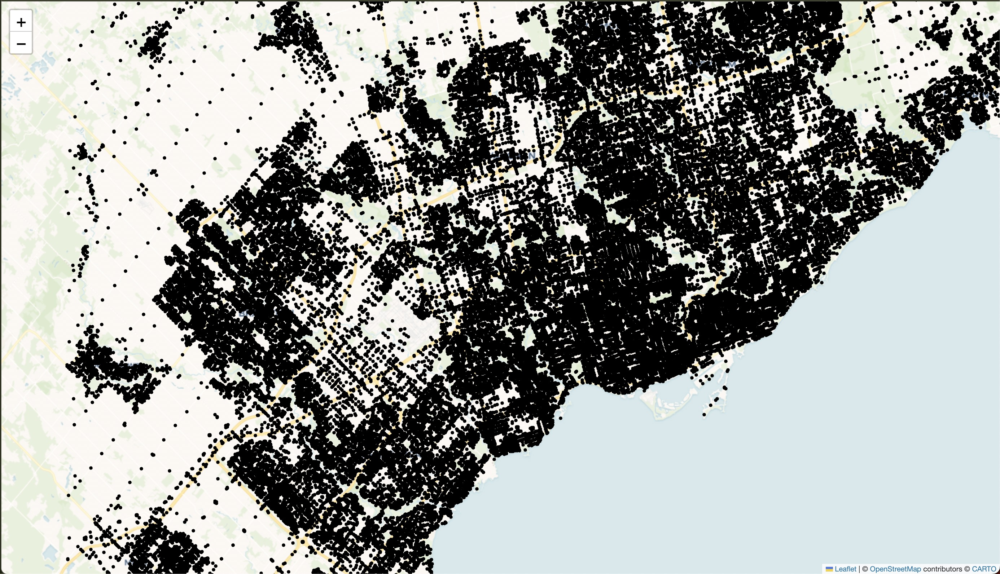
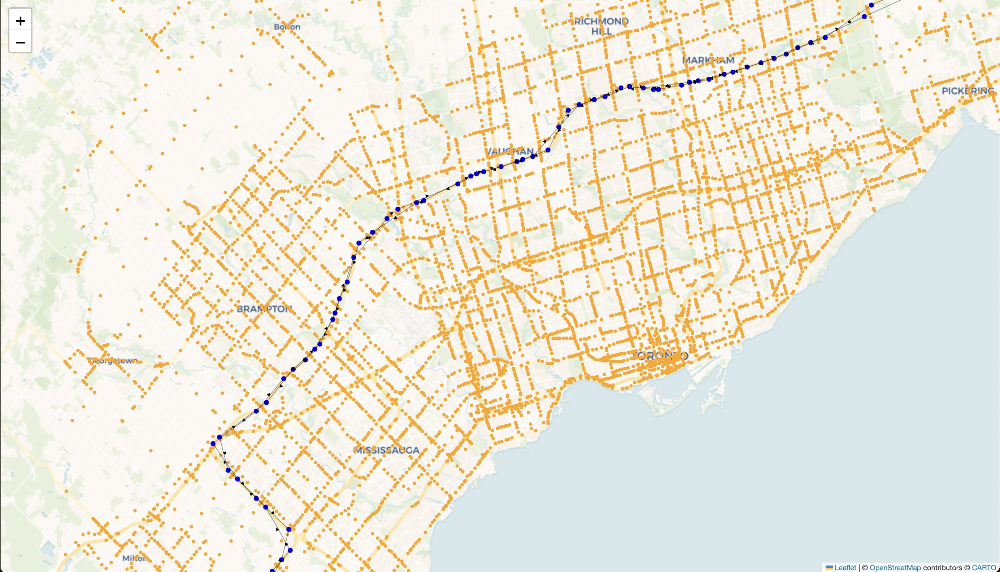
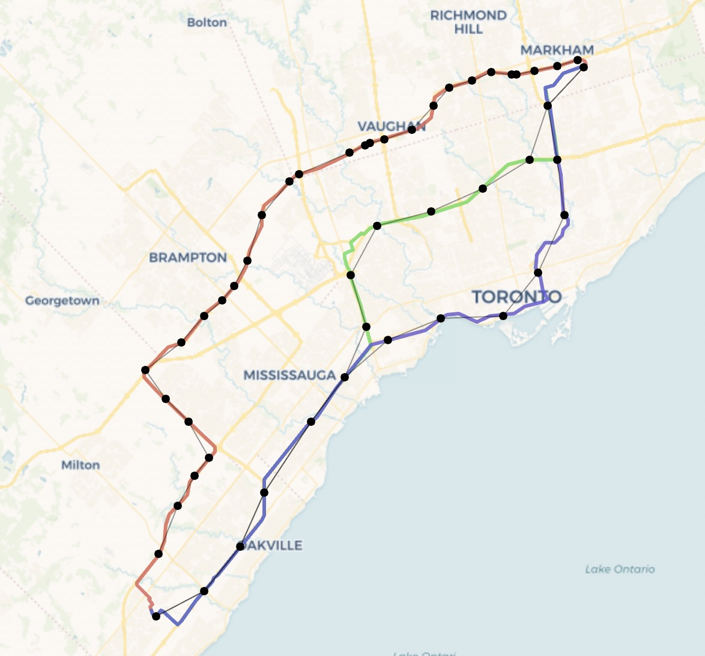
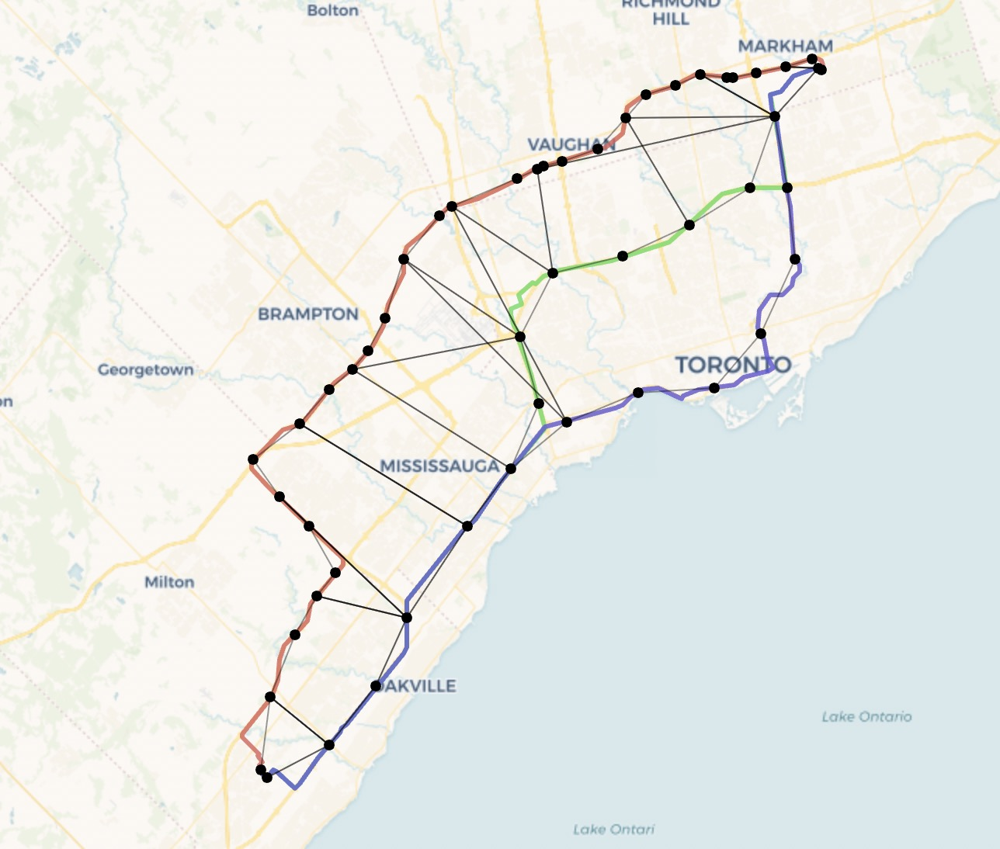
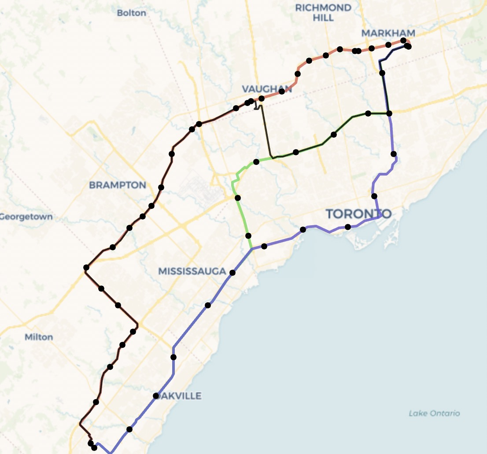

# GTA Commuter Buddy
GTA Commuter Buddy is an open source, web mapping application that allows users in the Greater Toronto Area (GTA) to find their optimal route (using toll and non-toll roads) under their desired budget.

Deployed version coming soon.

## Motivation for the Project
Rush hour traffic in the GTA can be extremely gruelling, and public transit infrastructure is not expansive enough to accomodate many commuting routes in a reasonable time frame. Additionally, major toll roads like the 407 ETR charge by the kilometer, which can incur hefty fines. It can be difficult to find a toll route for your desired budget (while also factoring in real-time traffic). Common mapping applications like Google Maps only show the toll route which saves the most amount of time, but doesn't factor in budget at all.

Commuters can try:
- Manual trial and error
  - Create waypoints on Google Maps for different highway entrances/exits and cross reference the tolled portions with the 407 ETR Trip Calculator. Unfortunately, the waypoints UI is clunky and doesn't allow you to search for highway entrances/exits.
- Dedicated toll route calculators
  - Don't allow you to enter a specific budget, only show the supposed "optimal value route"

These solutions have their own drawbacks, which is why I wanted to create this project.

## Tech Stack
Backend: Python
- Lightweight REST API layer: Fast API
- Routing Engine:
    - OSMNx (Open Street Maps for underlying graph)
    - HERE API (for real-time routing and traffic data)

Frontend:
- Next js (TypeScript, TailwindCSS)
- React MapBox (Mapping Interface and Search suggestions)
- Mantine (UI Library)

## Technical Architecture
When looking at how to determine which 407 entrances/exits would be best for a given route while staying under budget, I thought of the classic Computer Science shortest-path algorithm, Djikstra's Algorithm. While researching, I discovered a variant of the algorithm called Contrained Djikstra's Algorithm which introduces a constraint, in this case a monetary budget. However, in order to build a necessary graph, I'd need to determine the duration and toll cost from one waypoint to another for the edge weights. Therefore, I wanted to leverage existing real-time routing APIs to get the edge weights.

Here's the high-level technical flow:
 

**Before a user route request:**
1. Get initial GTA graph using OSMNx (Open Street Maps)
    - Extract 407 interchanges into a toll graph and label the interchanges based on their reference number (the distance from the first interchange)
    - Find and filter major intersections in GTA graph
    - These graphs are pre-loaded in memory and are ready before each user route request
  <!-- Show before and after images of initial GTA graph to saved graphs -->
  <table style="border: none; border-collapse: collapse;">
    <tr style="border: none;">
      <th style="border: none; padding: 8px; text-align: center;">Before</th>
      <th style="border: none; padding: 8px; text-align: center;">After</th>
    </tr>
    <tr style="border: none;">
      <td style="border: none; padding: 8px;">
        
      </td>
      <td style="border: none; padding: 8px;">
        
      </td>
    </tr>
  </table>
   
  
**On each user route request:**
1. Build the User Route Graph:
    - Use HERE API to get polyline route data for 3 potential routes
    - Map the polyline data onto the 407 toll graph. If a toll route is returned and it intersects with the 407 toll graph, the route is a budget-elligible route (we can calculate the best route for a given budget). If no toll route is returned, or it is not budget-elligible, the route data is immediately returned to the user (all subsequent steps are no longer executed).
    - The polyline data for the routes are mapped onto the GTA graph
    - These graphs are stored as the User Route Graph
    <!-- Show an image of the user route graph with nodes and edges -->

    

      
    

     

2. Simplify the User Route Graph:
    - A simplified subset of the toll nodes is calculated (where nodes are at least 5 km apart) for the connection points 
    - For the non toll routes in the graph, the nodes which are closest to a toll node are kept in the graph and connected to that toll node
    <!-- Show an image of the simplified, connected graph -->
    
    

      
    

     

3. Get real-time traffic durations between nodes in the graph
    - Using the User Route Graph, map nodes into waypoints for HERE API route requests
    - Set the duration between waypoints as edge weights in the graph
    <!-- Show graph with labels for edges -->

4. Calculate toll costs between toll nodes (HERE API provides this but I found it to be inacurate, possibly outdated)
  <!-- Show image of toll cost chart -->

5. Use the Constrained Djiktra's Algorithm to calculate the fastest route under the budget
  <!-- Show highlighted path in graph -->
  

    
  

   

## Features
- Departure time selection ("Leave Now" or specific time), budget selection, geolocation selection ("Use Current Location")
- Route animations, route summaries, animated route indicators, loading animations
- Automatic refreshes for up-to-date route data 
- Geolocation accuracy checking for caching location (if the user hasn't moved) - See handleUseCurrentLocation in MapSearchInput.tsx
- Custom Search Boxes for cleaner UI (using MapBox API for address, POI search suggestions) rather than the built-in React MapBox SearchBox
- SlidingTTLCache in backend to avoid recomputing the same route in the last 5 minutes (with the same options)
- Modular, organized code and tests

## TODOs / Aspects to Improve
- add database and authentication so users can save their home + work locations, scheduled routes calculated just in time, and get notified daily
- save route options like origin, destination, depTime, budget in the URL instead of React State so routes can be shared and persist after reload
- optimize routing engine to improve speed
- show a list of turn-by-turn directions after the route is returned
- improve UI for mobile on web
- fix issues with detour artifacts
- refine how connection points are chosen on the route graph for better results

# Long Term Goals
- Show areas of high traffic in route
- Port as a mobile app with live navigation